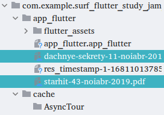

# Результаты

Использован flutter_bloc для стейт-менеджмента и get_it для инжектирования зависимостей.

 ## Валидация pdf url ссылки в BottomSheet
Url считается валидным если:
- строка не пустая
- строка является url (Uri.parse(url).isAbsolute == true)
- файл имеет расширение pdf

  

## Скачивание файла pdf и сохранение в AppDirectory
Файлы сохраняются в /app_flutter. Должны были сохраняться в cache/AsyncTour

  

## Прогресс загрузки файла
https://user-images.githubusercontent.com/6748047/230838769-e07f093a-94be-4259-8d39-3816675c01fc.mp4

## Отмена загрузки
https://user-images.githubusercontent.com/6748047/230838698-9b2163ad-3d4c-4872-b1a6-1e464922b43c.mp4

## Отображение снекбара при добавлении билета

  

## Удаление билета через свайп в сторону (Dismissable)
https://user-images.githubusercontent.com/6748047/230838523-c1de7e15-ad8e-4a70-a9dd-7a94ea201f4e.mp4

## Просмотр pdf
https://user-images.githubusercontent.com/6748047/230838446-c64044d9-21f5-4a7c-9be1-e0e564279fce.mp4

